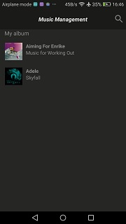
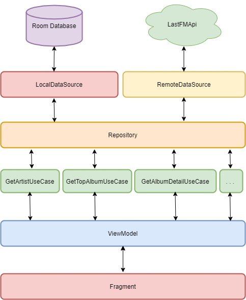

# Music Managemnt
Music management Android application via clean architecture



## overview
This is a sample Android mobile project that:

* enables to search an artist name and see all the artist's top albums
* enables to store favorite albums locally 

## Architecture



Application is built on top of MVVM model with the following key layers:

### [Data] Repository pattern

A key part is Repository pattern - an interface responsible for fetching and saving data. 

```kotlin
interface Repository{
     fun getArtist(artistName: String, pageNum: Int): Result<Failure, ArtistsData>
     fun getArtistTopAlbum(artistName: String, pageNum: Int): Result<Failure, TopAlbumsData>
     fun getAlbumDetail(artistName: String, albumName: String): Result<Failure, AlbumDetailView>
     fun getSavedAlbumDetail(artistName: String, albumName: String): Result<Failure, AlbumDetailView>
     fun getSavedAlbums() : Result<Failure, List<TopAlbumView>>
     fun saveAlbumDetail(artistEntity: ArtistEntity, albumEntity: AlbumEntity, trackEntityList: List<AlbumTrackEntity> ): Result<Failure, String>
     fun checkAlbumExistence(artistEntity: ArtistEntity, albumEntity: AlbumEntity): Result<Failure, String>
     fun deleteAlbum(artistEntity: ArtistEntity, albumEntity: AlbumEntity): Result<Failure, Unit>
}
```
Repository implementation is based on both remote and local data sources.

### [Data] Remote data source with Retrofit

Remote data source is responsible for fetching data from lastfm Api 

```kotlin
interface LastfmApi {

    @GET(URL)
     fun getArtist(
        @Query("method") method : String = METHOD_SEARCH
        , @Query("api_key") apiKey : String = API_KEY
        , @Query("format") format : String = FORMAT_JSON
        , @Query("limit") itemPerPage : Int = ITEM_PER_PAGE
        , @Query("artist") artistName : String
        , @Query("page") page : Int
    ): Call<ArtistSearchResponse>
...
}
```
### [Data] Local data source with Room

Local data source is responsible for storing and retrieving data from local database 

```kotlin
@Dao
interface AlbumDao {
    @Insert
    fun insertArtist(artist: ArtistEntity)

    @Insert(onConflict = OnConflictStrategy.REPLACE)
    fun insertAlbum(album: AlbumEntity)

    @Insert(onConflict = OnConflictStrategy.REPLACE)
    fun insertTracks(tracks: List<AlbumTrackEntity>)
    
    @Transaction
    fun insertAlbumWithTracks(album: AlbumEntity, tracks: List<AlbumTrackEntity>) {
        insertAlbum(album)
        insertTracks(tracks)
    }
    
    @Query( "SELECT album_table.album_name AS albumName, album_table.album_img AS albumImage, artist_table.artist_name AS artistName FROM album_table INNER JOIN artist_table ON album_table.album_artist_id == artist_table.artist_id ")
    fun getAlbumAndArtist(): List<TopAlbumView>
    
    @Query( "SELECT  album_table.album_id AS albumId, album_table.album_img AS albumImg FROM album_table INNER JOIN artist_table ON album_table.album_artist_id == artist_table.artist_id WHERE artist_table.artist_name = :artistName AND album_table.album_name = :albumName" )
    fun getAlbumInfo(artistName: String, albumName: String): TopAlbumInfo
    
    @Query("Select track_name AS name FROM track_table WHERE track_album_id = :albumId")
    fun getAlbumTracks(albumId: String) : List<AlbumDetailTrack>
    
    @Query( "DELETE FROM album_table WHERE album_id = :albumId")
    fun deleteAlbum(albumId: String)
    
    ...
    
 ```

### [Domain] Demonstrating application with use cases

Domain layer is the key part for having a good grasp of application features. The usecases reperesents the business logic behind the music management application.

Here is an example:

```kotlin
class GetArtistUseCase(private val repository: Repository):
    UseCase<ArtistsData, GetArtistUseCase.Params>() {

    override suspend fun run(params: Params): Result<Failure, ArtistsData> =
        repository.getArtist(params.searchString, params.pageNum)

    data class Params(val searchString : String, val pageNum : Int)
}
```
### [ViewModel] ViewModel with Architecture Components

ViewModel - "lifecycle conscious" component that enables use-case-based data survive any lifecycle configuration changes. ViewModel is also responsible for use case lifecycle management.

```kotlin
...
    fun searchArtist(searchString: String, pageNum: Int = 1) {
        ...
        
        viewModelScope.launch {
            getArtistUseCase(Params(searchString, pageNum)) { result ->
                result.fold(::handleFailure, ::handleSuccess)
            }
        }
    }
    ...
    
```

### [View] Load images with Glide

In order to provide handy image loading off the main thread, Glide library with Kotlin extention function is userd:
* **Extension functions** where generally speaking, it's mainly used for improving code we don't control, but can also make our code more readable from high-level standpoint.

```kotlin
fun ImageView.loadFromUrl(url: String) =
    Glide.with(context)
        .load(url)
        .placeholder(R.drawable.ic_image_place_holder)
        .error(R.drawable.ic_broken_image)
        .transition(DrawableTransitionOptions.withCrossFade())
        .into(this)!!
 ```
 
 ### [View] UX-driven background process handling with sealed class

Asynchronous repository call with remote service usage may result with a problem - it's crucial to inform the user about the current state. In order to handle all of the states from the limited set, a sealed class is used.

```kotlin
sealed class Failure {
    object NetworkConnection : Failure()
    object ServerError : Failure()
    object UnknownError : Failure()
}
```

## Modularity and scalability with Koin

To provide app modularity and scalability Koin dependency injector is used.

```kotlin
val applicationModule = module(override = true) {
    factory { RemoteDataSourceImpl() as RemoteDataSource }
    factory { LocalDataSourceImpl(get()) as LocalDataSource }
    factory { RepositoryImpl(get(), get(), get()) as Repository }
    ...
```


### Unit tests with Mockito

Domain part of the code is unit tested using Mockito.

```kotlin
...
  @Mock
  private lateinit var repository: Repository
  
  @Test
  fun `getTopAlbumUseCase should return data from repository`(){
      given { repository.getArtist("tst", 1) }.willReturn(Result.Success(artistDataTest))

      runBlocking { getArtistUseCase.run(GetArtistUseCase.Params("tst", 1))}

      verify(repository).getArtist("tst", 1)
      verifyNoMoreInteractions(repository)
  }
```

### Instrumentation tests 


```kotlin
    @Before
    fun initDatabase(){
        database = Room.inMemoryDatabaseBuilder(ApplicationProvider.getApplicationContext()
            , AlbumDatabase::class.java).allowMainThreadQueries().build()
    }

    @After
    fun closeDatabase(){
        database.close()
    }

    @Test
    fun insert_album_with_tracks_and_fetch_album_tracks(){
        val albumId = "ab-cd"
        val trackName = "track_name"
        val album = AlbumEntity(albumId, "1", "name", "url")
        val track = AlbumTrackEntity(123, trackName, albumId )

        database.albumDao().insertAlbumWithTracks(album, listOf(track))

        val fetched = database.albumDao().getAlbumTracks(albumId)

        fetched[0].name shouldBeEqualTo trackName
    }
```

```kotlin
   @Test
   fun click_on_search_button_will_redirect_to_search_fragment() {
       val mockNavController = mock(NavController::class.java)

       launchFragmentInContainer() {
           MyAlbumFragment()
               .also { fragment ->
                   fragment.viewLifecycleOwnerLiveData.observeForever { viewLifecycleOwner ->
                       if (viewLifecycleOwner != null) {
                           Navigation.setViewNavController(
                               fragment.requireView(),
                               mockNavController) } } } }

        onView(withId(R.id.searchButtonIV)).perform(click())

        verify(mockNavController).navigate(R.id.action_albumFragment_to_searchArtistFragment)
   }  
```
    
    


